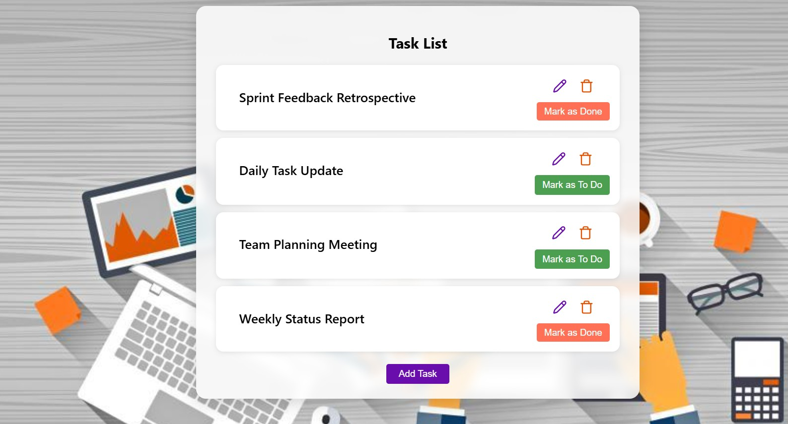
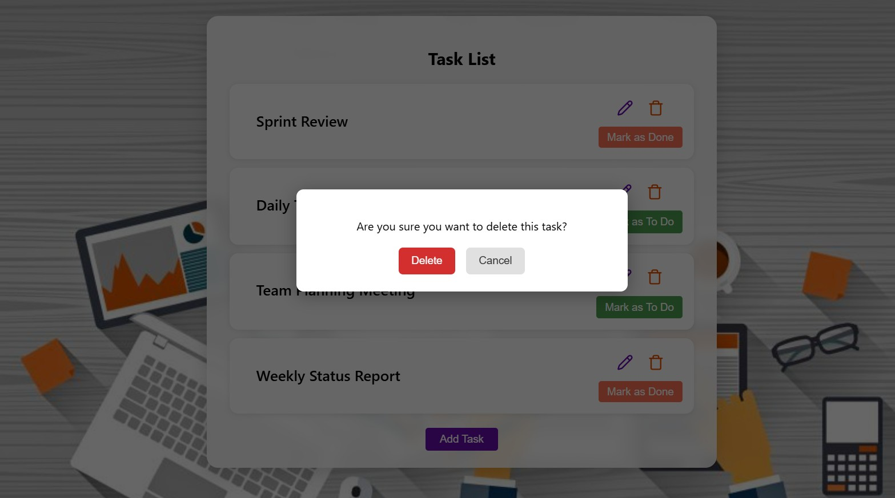
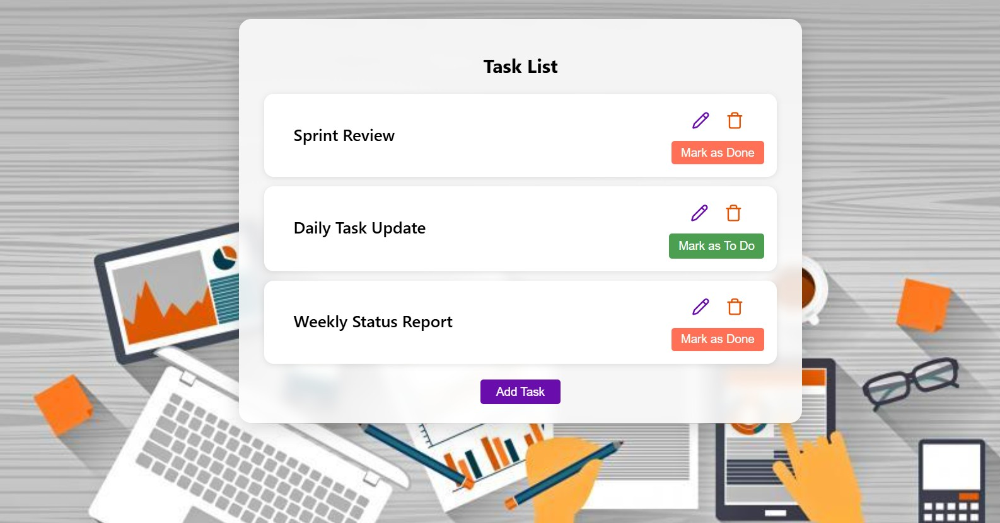

# Smart Task Manager

Smart Task Manager is a full-stack application built with .NET backend and Angular frontend. It allows users to create, update, and delete tasks.

## Features

- Create new tasks
- Update existing tasks
- Delete tasks

## Tech Stack

- **.NET Core** (C#)
- **Angular**
- **Cosmos DB** (optional for cloud demo)

## Screenshots

### Empty Task List


### Create Task


### Task List (Initial View)


### Update Task


### Delete Task


### Task List (After Updates)


## Getting Started

To run this project locally:

### Backend Service

```bash
# Clone this repository
git clone https://github.com/SunithSomanNair/smart-task-manager.git

# Navigate into backend folder
cd smart-task-manager/backendservice

# Build the project
dotnet build

# Run the project
dotnet run

```

### Client Service

```bash
# Navigate into client folder
cd smart-task-manager/client-app

# Install dependencies
npm install

# Run the Angular dev server
ng serve

```

### Configuration (Optional for Azure)

If deploying to Azure App Service with Cosmos DB, update launchSettings.json with:

```json
{
  "CosmosEndpoint": "<your-endpoint>",
  "CosmosKey": "<your-key>",
  "CosmosDatabase": "<your-database>",
  "CosmosContainer": "<your-container>"
}